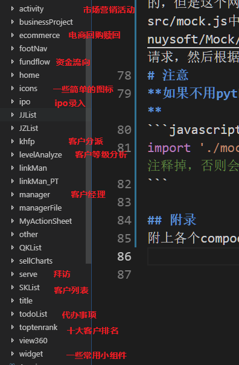

# 汇添富移动端注意事项


## 关于打包
  总共三种环境的：内网、测试、正式，打包前要把apiList文件中对应的href改成对应的值, 其他的注释掉就行。
```javascript
let href = "/rest/ncrm";       //测试网关
let href = "/microservice/ncrm";        //正式网关
let href = "";       //内网
```
如果是测试或者正式网关中的包要把app.jsx中，state中的success改成false。
```javascript
constructor(props, context) {
    super(props, context);
    this.context.router;
    this.state = {
        isSuccess: true,//网关改false;
    }
}
```
然后打包发送给曹庆军就行，他是那边负责包管理的人。<br>
由于经常打包，发包，每次都要修改，发完包后又得改回来，比较繁琐如果电脑里装了python解释器，可以运行bundle.py来一键进行发包。支持以下功能：
1. 打包前提交到git仓库，防止打包过程中修改文件发生意外，可以随时回退版本。
2. 根据参数自动修改打包前配置
3. 打包后自动把相应参数改回开发环境对应配置
4. 运行之后压缩文件在项目根目录的上级目录中文件名为`dist移动-${对应的环境}.zip`
5. 微信自动发送压缩包，（需要python itchat库，并且要修改库中代码才能发中文名的文件，这儿就不赘述了）

使用方法:<br/>
在项目根目录下运行一下命令，其中对应参数为:内网、测试网关、正式网关。
```
python ./src/bundle.py  对应参数
```
## 关于首页权限
生产环境（正式网关）情况下，务必注意要添加上首页的权限判断。每当首页上新增一个新入口的时候，在home/index.jsx中的state中添加相应的权限字段。
```javascript
constructor(props, context) {
        super(props, context);
        this.state = {
            menusRules: {                   //对应入口的权限
                "qianke": false,            //潜客
                "kehu": false,              //客户列表
                "lianxiren": false,         //联系人
                "jingzhengduishou": false,  //竞争对手
                "jijinchanpin": false,      //基金产品管理
            },
```
然后在`handleTabs`方法中对应的tabs栏目添加权限字段:
```javascript
 handleTabs(data) {
        let _arr = [];
        if(data.qianke || data.kehu || data.lianxiren) {//如果新入口放在客户管理栏目里，则添加到这儿
            _arr.push({title: '客户管理', value:'homeKH', key: '客户管理'});
        }
        if(data.kehujingli) {
            _arr.push({title: '团队管理', value:'homeTD', key: '团队管理'});
        }
        if(data.jingzhengduishou || data.jijinchanpin || data.shangjiguanli || data.jijinjingli) {//如果新入口....
            _arr.push({title: '销售管理', value:'homeXS', key: '销售管理'});
        }
        if(data.daibanshixiang) {
            _arr.push({title: '工作管理', value:'homeGZ', key: '工作管理'});
        }
        if(data.shichangyingxiao||data.ipo) {
            _arr.push({title: '营销管理', value:'homeYX', key: '营销管理'});
        }
        if(data.baifangjilu||data.qiandao) {
            _arr.push({title: '服务管理', value:'homeFW', key: '服务管理'});
        }
        this.setState({
            tabsData: _arr
        })
    }
```
然后在对应的入口前加上权限字段。
## 关于Mock数据
开发环境下数据得自己模拟，之前很多栏目都是在easymock中配置的，但是这个网站老崩，所以后来就使用mock.js了，相关配置在src/mock.js中，[具体使用方法见此](https://github.com/nuysoft/Mock/wiki/Getting-Started)。会拦截对应的Url的ajax请求，然后根据模板返回对应的数据。<br>
# 注意
**如果不用python打包脚本，在打包前把app.jsx中如下代码注释掉**
```javascript
import './mock.js';                    //mock数据，打包时注释掉，否则会拦截ajax请求
```

## 附录
附上各个compoents下我写的部分文件夹所对应的模块<br/>

